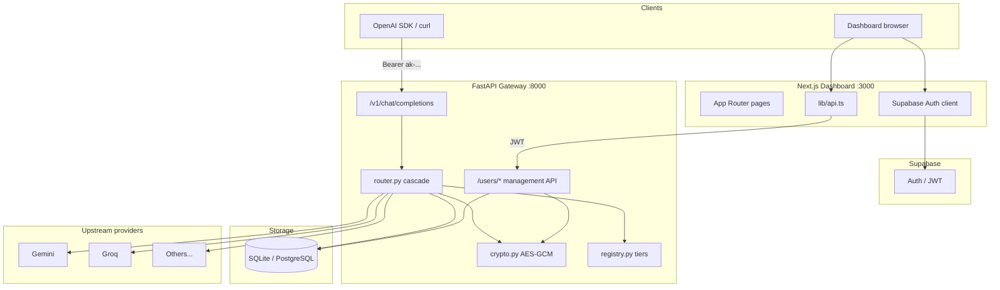
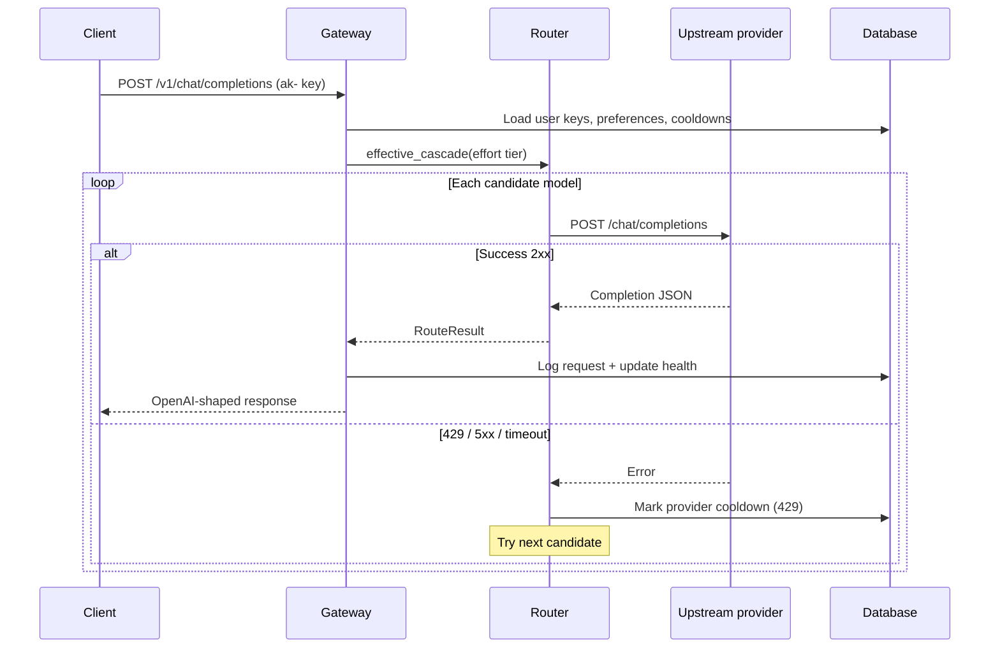
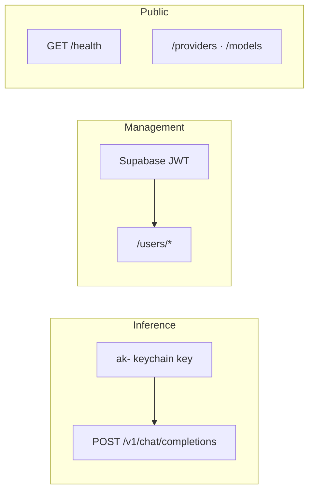
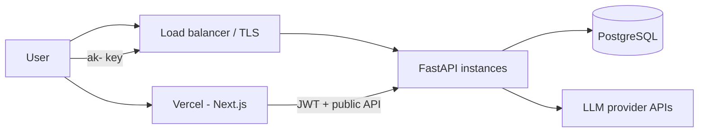

# Architecture

API Keychain is a two-tier application: a **FastAPI gateway** that proxies and
routes inference requests, and a **Next.js dashboard** for configuration and
analytics.

## High-level diagram

## Request routing flow

## Component responsibilities

### Gateway (`main.py`)

- FastAPI application entry point
- JWT auth dependency for `/users/*`
- Keychain key auth (`ak-...`) for `/v1/*`
- Request logging, usage aggregation, provider health tracking
- Streaming and non-streaming chat completion handlers

### Router (`router.py`)

- Builds ordered candidate list from effort tier + user overrides
- Round-robin across multiple keys per provider
- Deprioritizes providers in cooldown after HTTP 429
- Returns first successful upstream response or aggregates failures

### Registry (`registry.py`)

- Provider catalog with OpenAI-compatible base URLs
- Default `MODEL_TIERS` for low / medium / high
- `effective_cascade()` merges registry with user model table and preferences

### Crypto (`crypto.py`)

- HKDF-derived AES-256-GCM encryption for provider keys at rest
- SHA-256 hashing for keychain token lookup
- Token masking for dashboard display

### Models (`models.py`)

SQLAlchemy entities:

| Model | Purpose |
| --- | --- |
| `User` | Dashboard user linked to Supabase ID |
| `KeychainKey` | `ak-` inference keys (hashed) |
| `ProviderKey` | Encrypted upstream credentials |
| `UserModel` | Per-user model enable/priority overrides |
| `UserPreference` | Preferred/excluded providers and models |
| `ProviderHealth` | Cooldown and status per provider |
| `RequestLog` | Per-request analytics |

### Dashboard (`app/`, `components/`, `lib/`)

- Supabase email/password authentication
- SWR-backed management API client (`lib/api.ts`)
- Pages: dashboard analytics, providers, keys, models, preferences, settings
- Static catalog mirror (`lib/catalog.ts`) for provider metadata in UI

## Authentication surfaces

## Data flow for provider keys

1. User submits plaintext key in dashboard.
2. Gateway receives key over HTTPS on authenticated management route.
3. `encrypt()` stores ciphertext in `ProviderKey.encrypted_key`.
4. On inference, `decrypt()` runs in memory only for the upstream call.
5. Plaintext is never returned to the client after initial storage.

## Deployment topology

Typical production layout:

## Extension points

- **Custom models:** `POST /users/{id}/models` adds entries to the user cascade
- **Registry overrides:** `provider_catalog(overrides=...)` supports future per-user base URLs
- **DATABASE_URL:** swap SQLite for PostgreSQL without schema changes

See [api-reference.md](api-reference.md) for endpoint details.
